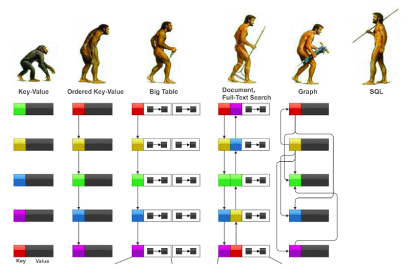
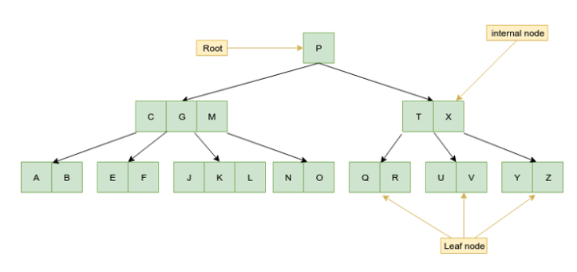
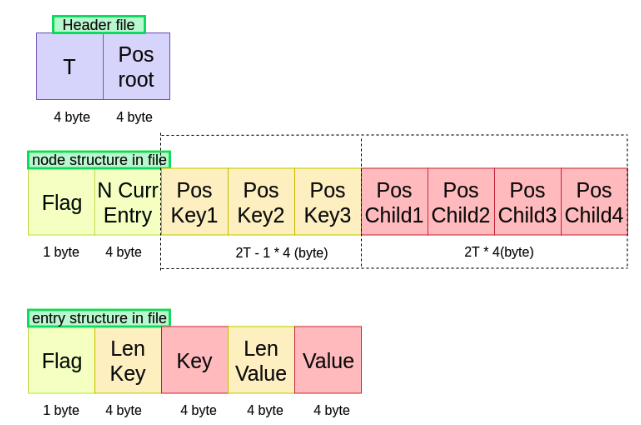
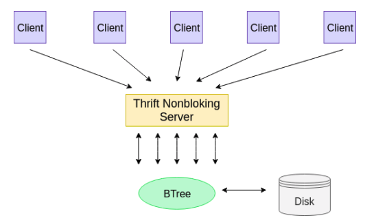

## Implement Key-value store by BTree
<div align="center">
	
	<br/>
	<span align="center">
		<i></i>
	</span>
</div>
<br/>

## Introduction

A Key-Value store are the simplest of the NoSQL databases that is used in almost every system in the world. It can be as simple as a hash table and at the same time, it can also be a distributed storage system. And A Key-Value store is implemented by different data structures. As LevelDB uses LSM-Tree, Redis uses hashtable, InnoDB uses B+Tree,..

The blog is written by Tai Pham and Thuyen Phan.

In this blog, we'll talk about Key-Value store service using  BTree
structure. Key-Value stores is also a topic of our mentor assigned to us during our internship at VNG. 

## Motivation
Implement Key-Value Store by B-Tree is a challenge for us. But this will be a first step stone for database research. And we make this article aimed at sharing the learning process as well as being implementing the challegent.

## What is Key-Value Stores ?
A key-value database, also called a key-value store, is  a type of 
[nonrelational](http://basho.com/resources/nosql-databases/) database that uses a simple key-value method to store data. Key-value databases have emerged as an alternative to many of the limitations of traditional [relational databases](https://en.wikipedia.org/wiki/Relational_database), where data is structured in tables and the schema must be predefined. 

Values are identified and accessed via a key, and store values can be binarys, numbers, string, XML, JSON, HTML, image.

A key-value store offers several advantage like: flexible data modeling, high performance, high availability, operational simplicity, massive scalability.

There are multiple implementations of the key-value store that are used in production grade systems worldwide. Some example open source implementations are Redis, CouchDB, MongoDB, and Cassandra (which uses a b-tree as the underlying data structure). 

This is [DB-Engines Ranking of Key-value Stores](https://db-engines.com/en/ranking/key-value+store)

## The problem of storing data on memory
As we know, accessing data on memory is faster than hard disk. But memory is limited, data is not. In addition to saving data on memory is not safe in case the program crash for any reason. So we must store data under on hard disk when there is big data and data must be persisted.

Life is not like a dream, the use of disk for storage needs to solve disk access time problems. Therefore, we need to design a structure to store data under file system so as to reduce the number of disk accesses. 

Redis and memcache both choose the [hashtable](https://en.wikipedia.org/wiki/Hash_table)  for this data structure. It’s a good choice because it is fast; with a good hash function, both read and write operations take place in O(1) time.

LevelDB and RocksDB both use the [log-structured merge-tree](https://en.wikipedia.org/wiki/Log-structured_merge-tree) to store its data. LevelDB and RocksDB implementation offers very good performance for writes, and good performance for reads.

And there are many data-store implementations that use the [BTree](https://en.wikipedia.org/wiki/B-tree) as [LMDB](http://www.lmdb.tech/doc/), [BerkeleyDB](https://en.wikipedia.org/wiki/Berkeley_DB). This blog post will show you how to implement a key-value store with B-Tree. 

## Why use B-Tree to implement this?
Let's take a quick talk at both the read and write data types of **HDD** (Hard Disk Drive) and **SSD** (Solid State Drive). 

As you might have read, using traditional HDD for read or write is very low. When the data needs to read or write, the actuator with an arm, needs to go to a particular sector on the track to read or write data. This is measured as seek time. After that, the drive needs to rotate to reach to a particular sector (rotational latency). This happens really fast but when we are reading huge amount of data, it might become a bottleneck since disk has to continuously move to specific sectors. Average seek times vary from 4ms for high end servers to 9ms for commonly used desktop drives.

SSD (Solid State Drive) offer superior performance because they have electrical connection for locating specific memory areas.  But still, they also have average seek time of .10ms which might add up overtime for large data sets. Also, SSDs are expensive as compared to HDDs so not everyone is able to afford those.

**Why are we talk to hard disk access?** When we are accessing large data set and doing frequent read or write from disk, we need consider this cost of read/write.

So **what's B-Tree related here?** Does using the B-Tree structure reduce this cost? Most of the operations of the B-Tree (search, insert, delete, max, min, ...) require disk access with O(h) times. O(h) is the height of the B-Tree. B-Tree is a self-balancing search tree or fat tree. The height of B-Trees is kept low by putting maximum possible keys in a B-Tree node. Since the data is read from disk in the form of blocks. So we have to design a B-Tree node size that is equal to disk block size. At the same time, the height of B-Tree is low, so the total disk access for most of the operations are reduced significantly. In addition, rebalancing of the tree occurs less often. And time complexity to search, insert and delete of B-Tree is O(logn), it will help increase performance.

Moreover, there is a data structure that can solve the problem of reducing disk accesses: [B+Tree](https://en.wikipedia.org/wiki/B%2B_tree). The B+Tree is a modification of the b-tree that stores data only in leaf nodes, minimizing search cost in the common and worst case, and (optionally) links together all the leaf nodes in a linked list, optimizing ordered access. B+ trees are extensively used in both database and file systems because of the efficiency they provide to store and retrieve data from external memory.

## About B-Tree

<div align="center">
	
	<br/>
	<span align="center">
		<i></i>
	</span>
</div>
<br/>

In computer science, a B-Tree is a self-balancing tree data structure that maintains sorted data and allows searches, sequential access, insertions, and deletions is logarithmic time. The B-tree is a generalization of a [binary search tree](https://en.wikipedia.org/wiki/Binary_search_tree) in that a node can have more than two children.

**Why have B-trees been invented?** Actually, binary trees are faster because the number of comparisons you have to make to retrieve a value is also equal to the number of levels.  If the binary-tree is balanced, this will be log2(nb values).  In a B-tree, as we hold up to N values in each node, the number of node you will fetch is logN(nb values), but for each fetched node, we also have to do log2(n values in node) comparison per level.  

So B-Tree are less efficient than balanced binary-trees, that's a fact. **Why then should we use a B-Tree?**. Because we don't process data in memory only: we usually fetch them from disk.

Properties of B-Tree:
- All leaves are at same level.
- A B-Tree is defined by the term minimum degree ‘t’. The value of t depends upon disk block size.
- Every node except root must contain at least t-1 keys. Root may contain minimum 1 key.
- All nodes (including root) may contain at most 2t – 1 keys.
- Number of children of a node is equal to the number of keys in it plus 1.
- All keys of a node are sorted in increasing order. The child between two keys k1 and k2 contains all keys in the range from k1 and k2.
- B-Tree grows and shrinks from the root which is unlike Binary Search Tree. Binary Search Trees grow downward and also shrink from downward.
- Like other balanced Binary Search Trees, time complexity to search, insert and delete is O(Logn).

## Some operating system knowledge
### Memory Allocation
Simply memory allocation means: Reserving memory for specific purposes.

Programs and services are assigned with a specific memory as per their requirements when they are executed. Once the program has finished its operation, the memory is released and allocated to another program or merged within the primary memory.

Memory allocation has of two types :
Static Memory Allocation: 
- The program is allocated memory at compile time.
    - Use partition stack on virtual memory.
Dynamic Memory Allocation: 
- The programs are allocated with memory at run time.
    - Use partition heap on virtual memory.

### Memory Mapping
Between the break point and the base pointer is unallocated memory, but it may not be unused. This region can be memory mapped, which is the process of loading data directly from files into memory. You can directly memory map files, but often this is done automatically for you when you read and write files.

Another common use for the middle addresses is the loading of dynamic shared libraries.

Example:
When you make a call to a function like printf() or malloc(), the code for those functions exist in shared libraries, the standard C library, to be precise. Your program must run that code, but the operating system doesn't want to have load more code into memory than needed. Instead, the O.S. loads shared libraries dynamically, and when it does so, it maps the necessary code into the middle address spaces.

### Linux Thread Synchronization
Thread synchronization is defined as a mechanism which ensures that two or more concurrent processes or threads do not simultaneously execute some particular program segment known as critical section.
Process access to critical section is controlled by using synchronization techniques. When one thread starts executing the critical section the other thread should wait until the first thread finishes. If this not applied, it may cause a race condition where the variables may be unpredictable and vary depending on  the timings of context switches of the processes or threads.

### Readers - Writers Problem
Consider a situation where we have a file shared between many people.
If one of the people tries editing the file, no other person should be reading or writing at the same time, otherwise changes will not be visible to him/her.
However if some person is reading the file, then others may read it at the same time.

## Implement Key-Value Store by B-Tree
### Overview 
We use C++ programming language to implement this project. We approach in two different ways. I would like to introduce the first way and also my implement.

### The first way implement
In my project, I have applied some techniques like: 
- I build my project on a Linux OS environment.
- I write class template for B-Tree structure, so i can adapter to more than one data types without repeating the entire code for each data type. But i will use string data for the program.
- I will create a key-value store using Object-Oriented Programming.
- I use the Binary Search Algorithmic.
- Since i wanted to build a Key-Value Store service, i applied the server-client model. And I chose the thrift library to build server-client.
- I also solve I/O problem with disk access and use of the file system.
- And i have read some OS knowledge.

I will split a Key-Value Store Service into three part to implementation including B-Tree structure, Server-Client model and store data on disk.  

The project implementation steps are as follows:
Firstly, I built the client-interface Key-Value store class with the basic methods that they can interact it. This is also referred as the API. The minimum API for a key-value store must include the methods Get(), Set(), Exist()  and Delete().

On the server side of Key-Value Store service, I also build the same Key-Value Store interface. And B-Tree Store will inheritance it. After that, I define template class data key-value as string, i call the key-value pair as an entry. Next, I built B-Tree structure with the key defined entry. And node structure of B-Tree is as follows: 

```cpp
class BTreeNode{
    private:
         int nCurrentEntry; // current number of entry in node
         int t;  // the term minimum degree ‘t’. The value of t depends upon disk block size.
         char flag;  // is 1 when node is leaf. Otherwise false.
         Entry<K, V> **entries; // an array  of entry
         BTreeNode<K, V> **childs; // an array of child pointers.
}
```

Make sure that i have carefully tested the B-Tree structure methods before
processing to the next step. The B-Tree structure you can refer to [here](https://www.geeksforgeeks.org/b-tree-set-1-introduction-2/).

In this section I will talk about how to store data on disk. First of all i define the file structure for storing data on disk. The file structure database is as follows:

<div align="center">
	
	<br/>
	<span align="center">
		<i></i>
	</span>
</div>
<br/>

In order to store data of B-Tree on file, I has to change the B-Tree structure a bit like this:
```cpp
class BTreeNode{
    private:
        int nCurrentEntry;
        int t;
        char flag;
        int *arrayPosKey; // array pos key in file.
        int *arrayPosChild; // array pos child in file.
        int pos; // pos node in file.
}
```

I will explain the file structure as follows:
- Header file include two values: 
    - Minimum degree ‘t’: 4byte.
    - Position root BTree: 4byte.
- Node structure in file:
    - flag (1byte):
        - 0000 0000: the leaft.
        - 0000 0001: the node have child.
        - 0000 0010: the node was deleted.
    - nCurr Key (4byte): the current number of key of node.
    - array byte save positon of key: 4byte * (2*t - 1).
    - arry byte save positon of child node: 4byte * 2*t.
- Entry structure in file:
    - flag (1byte):
    - 0000 0000: the entry was remove or edit.
    - 0000 0001: the entry was active.
    - lenkey (4byte): len key.
    - key (string any size).
    - lenValue (4byte): len value.
    - value (string any size).

#### How does it work?
When the server is started, node root of B-Tree will read and kept  on memory. Actions with the B-Tree Store as insert, remove, search still follows the B-Tree algorithm. But we will do with position of entry and node on file. So when the client adds a new entry to the B-Tree store, a new entry will be written to the end of file. This is similar when writting a new node to the file. When the client want to remove any entry, i will mark that node by changing the value of the flag at beginning of entry. This is also similar when remove a node in the case merge two nodes. When client edits value of entry, i also mark that entry and write new entry to last file. When client want to get value of any key, i will search algorithm of B-Tree so as to find position node in file where contains key. After i read the node and use binary search in order to find position of key in file. Then i just read value at this position.

How do the entries or nodes that are marked remove or edit will process? In my idea, these entries or nodes will be removed to file after a period of time by compaction file. And these entries or nodes can help us track user behavior.

The technique i use in this section is the basic method of accessing a file is via the read() and write() system calls. Before a file can be accessed, however, it must be opened via a open() or creat() call.Once done using the file, it should be closed using the system call close() .

At the end of implementing, I would like to introduce the server-client architecture.
The following is the image of architecture.

<div align="center">
	
	<br/>
	<span align="center">
		<i></i>
	</span>
</div>
<br/>

The client will connect to the server and call API. The server handle Api based on api that B-Tree Store provided.

I have a idea that we can cache position of entry or node to help increase the performance of the Key-Value Store. But we have to solve the problem of data consistency.

The above is my approach to implement Key-Value Store by B-Tree. It is not a good implement, because I can not identify T (the value of t depends upon disk block size) of B-Tree in this approach. So the performance of this service will not be heigh. But my partner will be better than one for this problem.

This is repo of the first way implement: https://gitlab.zalopay.vn/taiptht/Module_key_value_store

### The second way implement
The second way implement key-value-stores is simple than the first way. In this way I also using B-Tree for data structure to store pair of key-value.
Almost Key Value Database must have to some method like: set, get, exist, remove and so on, so I do. In my mini project, the key value store has some method for access database like get, set, remove, exist.

Each database item is stored as a key, or attribute name, and is associated with a value. This can work very well for unstructured data as the database does not require a set schema across key-value pairs. This can scale very well and have high performance due to the simplicity of design and the fact that only the key is of interest to the database.

The first thing we need to know to implement the key-value-store is about system programming. Basic knowledge about system call, file I/O and memory management was needed.

I am starting this project in fresher course at VNG Corp, after this project I've gained a lot of experience and valuable knowledge of hardcore back-end engineering, but I know that I am going to learn a lot of new things too. This project allow me to review:
- The C++ programming language
- Algorithmics and data structures
- Memory management
- Concurrency control with multi-threading
- Networking with a server/client model
- I/O problems with disk access and use of the file system
- Some problem about concurrency control: producer-consumer problem, read-write problem.
- A little bit about preprocessor in C programming.
- Implementing key-value-stores using B-Tree, I read some ebook or blog about some algorithms in B-Tree, to understand clearly I recommend you read an book name 'Introduction to Algorithms' by Thomas H. Cormen.

#### Implement B-Tree
```cpp
// BTree:
class BTree {
    private:
        BTreeNode* root;
        public:
        char fname[20];
        int degree; 
        int next_pos; // next position in file for new node
        int root_pos; // position of root node
        FILE* f_bnode;
}
```

- BTree has some important fields like:
    - next_pos: mean next position in file, new node created will be here.
    - root_pos: mean that position belong to root node.
    - degree: the goal of a b-tree is to minimize the number of disk accesses. degree depends upon disk block size.

```cpp
// BTreeNode:
class BTreeNode {
    public:
        int degree;
        BTreeNode* child[2*t];
        int num;
        bool leaf;
        BTree* tree;
        int pos; // position of node in file
        int child_pos[ *t];
        DataStore data[2*t - 1];
}
```

- child: list of BTreeNode contains child of current node
- num: number of key store in node, number of child equal num plus one
- child_pos: very important field, this array contains the position of child - node in file
- pos: position of current node
- leaf: identify node was leaf or not


#### How it works
- When you modify node, using some method like: set or remove. Any node affect will be write to disk. And one more thing, when restart server, B-Tree will rebuild depend upon nodes.dat file and tree.dat file, read all available node to memory. In this way, need time to rebuild tree, but some access like get, exist will be faster. But this way sometimes bad, because you don't have enough space in memory, so the structure of B-Tree in this way use when you don't need to store a huge data, and you want to faster when search or check exist.
- I think the above way so bad, so I decide implement other version:

```cpp
// BTree:
class BTree {
    public:
        char fname[20];
        int next_pos;
        int root_pos;
        FILE* f_bnode;
}
    
// BTreeNode:
class BTreeNode {
    public:
        int num;
        bool leaf;
        BTree* tree;
        int pos;
        int child_pos[2*t];
        DataStore data[2*t - 1];
}
```

This look like older version, but that fields BTreeNode child[2t] was removed. This mean we don't have any tree structure in memory. Instead of we use pos in every node identify offset data node in file, when we want to access this node, we use pos and read node from file in exact pos we have. At each node we have fields call childpos[2t], this fields contain 2t value integer to identify child position in file.

So when we restart server, we no need to rebuild tree structure, we just read tree metadata file, it contain root position and next position. We use this node to figure out all node we need.

This is repo of the second way implement: https://gitlab.zalopay.vn/thuyenpt/key-value-store

## Issues surrounding the Key-Value store by B-Tree

[Write amplification (WA)](https://en.wikipedia.org/wiki/Write_amplification) is an undesirable phenomenon associated with flash memory and solid-state drives (SSDs) where the actual amount of information physically written to the storage media is a multiple of the logical amount intended to be written.  The NAND flash memory must be erased before it can store new data. In other words, data cannot be overwritten directly as it is in a hard disk drive. You can see more [here](https://vnreview.vn/tu-van-may-tinh/-/view_content/content/445083/co-ban-ve-luu-tru-so-phan-4-o-luu-tru-ssd) and [here](http://nisl.wayne.edu/Papers/Tech/wacost_tos.pdf)

Since we have to design a B-Tree node size that is equal to disk block size. So if we store data on SSD, we will have problem with "write amplification".  But LSM solved this problem. You can see more [here](http://smalldatum.blogspot.com/2018/10/minimizing-write-amplification-in-lsm_3.html)

## Conclusion
We are done with this blog post. Throught this post, we would like to share with you about implements Key-Value Store by B-Tree. Besides, there are some new knowledge related to database that we learn in the proccess. At the end, we very happy and would like to thank you our mentor  `anhld2` and `tannt3`.

## Reference
- http://basho.com/resources/key-value-databases/
- http://blog.justinsb.com/blog/2013/12/08/cloudata-day-2/
- https://en.wikipedia.org/wiki/Hard_disk_drive_performance_characteristics
- https://loveforprogramming.quora.com/Memory-locality-the-magic-of-B-Trees
- https://www.geeksforgeeks.org/b-tree-set-1-introduction-2/
- https://www.quora.com/In-filesystems-what-is-the-advantage-of-using-b-trees-or-b+trees-as-opposed-to-using-inode-indexes
- https://en.wikipedia.org/wiki/B-tree
- https://blogs.apache.org/directory/entry/let-s-meet-b-trees
- https://vnreview.vn/tu-van-may-tinh/-/view_content/content/445083/co-ban-ve-luu-tru-so-phan-4-o-luu-tru-ssd
- https://www.techspot.com/news/54107-understanding-ssds-why-ssds-hate-write-amplification.html
- http://nisl.wayne.edu/Papers/Tech/wacost_tos.pdf
- https://www.quora.com/How-does-the-log-structured-merge-tree-work
                                                                                                                                                                                                                                                                                                                                                                                                                                                                                                                                                                                                                                                                                                                                                                                                                                                                                                                                                                                                                                                                                                                                                                                                                                                                                                                                                                                                                                                                                                            